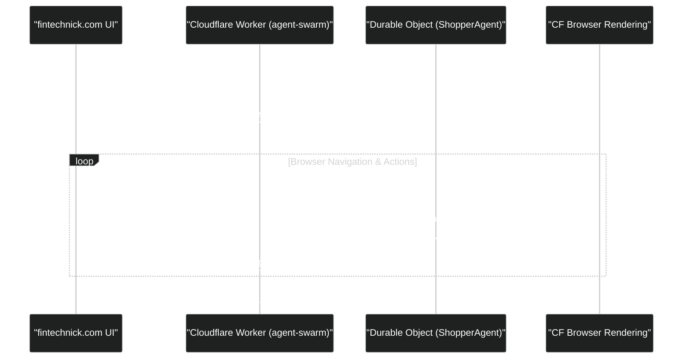

# Integration Guide: Connecting Agent Swarm to fintechnick.com

This guide outlines how to deploy your stateful **Agent Swarm** worker backend and integrate it into the frontend code of your personal website at [fintechnick.com](https://fintechnick.com).

---

## Architecture Overview

The `agent-swarm` backend runs as a Cloudflare Worker utilizing **Durable Objects** via the Cloudflare `agents` framework. 



---

## API Introspection & Discoverability (/info)

To make it easy for your website at [fintechnick.com](https://fintechnick.com) to understand and dynamically inspect what the Worker does, a public metadata endpoint is available at `GET /info` (and `/inspect`). 

This endpoint does **not** require HMAC signature headers or tokens and is fully CORS-enabled (allows requests from any origin), meaning you can request it directly from client-side SvelteKit scripts.

### Querying the API metadata
You can fetch it dynamically in SvelteKit:
```typescript
const response = await fetch('https://agent-swarm.YOUR_SUBDOMAIN.workers.dev/info');
const metadata = await response.json();
console.log(metadata.agents.ShopperAgent.methods.runShopping.parameters);
```

### JSON Schema Output
The returned payload uses standard JSON-schema-like typing to describe the agent parameters and requirements:
```json
{
  "name": "agent-swarm",
  "description": "Autonomous browser rendering swarm that runs stateful agent sessions.",
  "version": "0.1.0",
  "agents": {
    "ShopperAgent": {
      "description": "Launches a browser rendering session to browse, search, and purchase products in Stripe test-mode.",
      "methods": {
        "runShopping": {
          "description": "Triggers a browser automation sequence with the specified shopping persona.",
          "parameters": {
            "type": "object",
            "properties": {
              "persona": {
                "type": "string",
                "description": "The buyer behavior profile (e.g., 'A tech buyer looking for a sticker').",
                "required": true
              },
              "url": {
                "type": "string",
                "description": "Override URL to shop on. Defaults to the configured SHOP_URL.",
                "required": false
              }
            }
          },
          "returns": {
            "type": "string",
            "description": "A summary string of the shopping session outcome."
          }
        }
      }
    }
  }
}
```

---

## Step 1: Deploy the Backend to Cloudflare

To expose the API, you must deploy the worker to your Cloudflare account.

1. **Log in to Wrangler:**
   Make sure you are logged in to your Cloudflare account:
   ```bash
   npx wrangler login
   ```

2. **Configure Secrets:**
   You will need to set up your secrets (like your Gemini API Key) securely:
   ```bash
   npx wrangler secret put GOOGLE_API_KEY
   ```

3. **Deploy the Worker:**
   Run the deploy script to publish the worker live:
   ```bash
   npm run deploy
   ```
   Once deployed, note the worker's URL (e.g., `https://agent-swarm.YOUR_SUBDOMAIN.workers.dev`).

---

## Step 2: Install the Client SDK in the website repository

In your other GitHub project containing the `fintechnick.com` source code, install the official Cloudflare `agents` SDK:

```bash
npm install agents
```

---

## Step 3: Implement the UI Integration

Depending on what framework your personal website uses, you can easily connect to the deployed worker using either Vanilla JavaScript or React.

### Option A: Vanilla JavaScript / TypeScript

If your website uses plain JavaScript or a framework like Svelte, Vue, or Next.js Pages router, use `AgentClient` to connect and invoke actions:

```typescript
import { AgentClient } from "agents/client";

// 1. Initialize client connection
const client = new AgentClient({
  agent: "ShopperAgent",
  name: `session-${Date.now()}`, // Unique session ID for this shopping run
  host: "agent-swarm.YOUR_SUBDOMAIN.workers.dev", // Deployed Worker host
  onStateUpdate: (state) => {
    // This callback fires in real-time as the agent takes browser actions
    console.log("Current Agent Status:", state.status);
    
    if (state.history && state.history.length > 0) {
      const lastAction = state.history[state.history.length - 1];
      updateConsoleUI(lastAction); // Render step-by-step terminal output in UI
    }
  }
});

// 2. Trigger the agent via RPC when user submits form
async function startShopping(persona: string, url: string) {
  try {
    await client.ready; // Wait for WebSocket connection to open
    
    // Call the @callable() runShopping method on the Durable Object
    const result = await client.call("runShopping", [persona, url]);
    console.log("Session complete! Outcome:", result);
  } catch (error) {
    console.error("Agent execution failed:", error);
  }
}
```

### Option B: React Integration

If your personal website is a React or Next.js App Router application, you can use hooks or wrap the `AgentClient` in a React state hook:

```tsx
import React, { useState, useEffect } from "react";
import { AgentClient } from "agents/client";

export default function AgentConsole() {
  const [status, setStatus] = useState<string>("idle");
  const [logs, setLogs] = useState<string[]>([]);
  const [client, setClient] = useState<AgentClient | null>(null);

  const startSwarm = async (persona: string) => {
    const sessionId = `web-run-${Date.now()}`;
    const agentHost = "agent-swarm.YOUR_SUBDOMAIN.workers.dev";
    
    const newClient = new AgentClient({
      agent: "ShopperAgent",
      name: sessionId,
      host: agentHost,
      onStateUpdate: (state) => {
        if (state.status) setStatus(state.status);
        if (state.history) setLogs(state.history);
      }
    });

    setClient(newClient);

    await newClient.ready;
    try {
      setStatus("running");
      await newClient.call("runShopping", [persona]);
    } catch (err) {
      console.error(err);
      setStatus("failed");
    }
  };

  return (
    <div className="p-6 bg-slate-900 text-white rounded-lg">
      <h2 className="text-xl font-bold">Shopping Agent Console</h2>
      <div className="mt-2 text-sm text-gray-400">Status: <span className="font-semibold text-emerald-400">{status}</span></div>
      
      <button 
        onClick={() => startSwarm("Buy a cool developer sticker")}
        disabled={status === "running"}
        className="mt-4 px-4 py-2 bg-indigo-600 hover:bg-indigo-700 disabled:opacity-50 rounded"
      >
        Launch Shopper Agent
      </button>

      <div className="mt-6 bg-black p-4 rounded h-64 overflow-y-auto font-mono text-xs">
        {logs.map((log, index) => (
          <div key={index} className="text-green-400 mb-1">&gt; {log}</div>
        ))}
      </div>
    </div>
  );
}
```

---

## Best Practices for the Integration

1. **Access Control & Security**:
   Since running browser automation sessions consumes browser rendering credits and LLM tokens, you should secure your worker endpoint. Here are the primary strategies:

   #### A. Origin Verification (Easiest, browser-enforced)
   Restrict incoming WebSocket connections to only allow requests originating from your website's domain (`https://fintechnick.com`).
   
   To do this, modify the `fetch` handler in [src/index.ts](file:///workspaces/agent-swarm/src/index.ts#L399-L410):
   ```typescript
   export default {
     async fetch(request: Request, env: Env) {
       const origin = request.headers.get("Origin");
       const allowedOrigins = ["https://fintechnick.com", "http://localhost:3000"];
       
       if (origin && !allowedOrigins.includes(origin)) {
         return new Response("Forbidden Origin", { status: 403 });
       }

       return (
         (await routeAgentRequest(request, env)) ??
         new Response("Cloudflare Agent Swarm is running.", { status: 200 })
       );
     }
   };
   ```

   #### B. Static Secret Token (Simple query token)
   Generate a secret string and store it as a Cloudflare Worker secret:
   ```bash
   npx wrangler secret put CLIENT_ACCESS_TOKEN
   ```
   
   On the website, pass the token as a query parameter when creating the client:
   ```typescript
   // On the website UI
   const client = new AgentClient({
     agent: "ShopperAgent",
     name: sessionId,
     host: "agent-swarm.YOUR_SUBDOMAIN.workers.dev/ws?token=YOUR_SECRET_TOKEN",
     ...
   });
   ```
   
   Verify the query parameter in the Worker's `fetch` handler:
   ```typescript
   export default {
     async fetch(request: Request, env: Env) {
       const url = new URL(request.url);
       const clientToken = url.searchParams.get("token");
       
       if (clientToken !== env.CLIENT_ACCESS_TOKEN) {
         return new Response("Unauthorized", { status: 401 });
       }

       return (
         (await routeAgentRequest(request, env)) ??
         new Response("Cloudflare Agent Swarm is running.", { status: 200 })
       );
     }
   };
   ```

   #### C. HMAC / JWT Signature (Most Secure)
   If your personal website has a backend (like Next.js API routes or SvelteKit endpoints), you can sign short-lived tokens (e.g., valid for 5 minutes) on your backend using a shared key.
   1. The client requests a short-lived token from your site's backend (`GET /api/get-agent-token`).
   2. The backend generates a signed JWT or HMAC signature.
   3. The client connects to `agent-swarm` passing `?token=<JWT>`.
   4. The Worker verifies the signature before opening the session.
   
   This ensures that even if users examine the browser traffic, they cannot reuse the token once it expires.
2. **Handling CORS**:
   Since `AgentClient` initiates connection via a WebSocket handshake, CORS is bypassed for the WebSocket connect itself, but any prefix HTTP routes (if you fetch agent state or configurations directly) may require standard CORS headers.
3. **Session Durability**:
   Because the state is backed by Cloudflare Durable Objects, even if the user refreshes their web browser on `fintechnick.com`, you can reconnect to the same session using the same `name` (session ID) and query its state immediately!

---

## SvelteKit HMAC Pre-signed Token Implementation

Here is the exact code to implement **Option C (HMAC signatures)** using SvelteKit and your Cloudflare Worker.

> [!NOTE]
> To limit the "blast radius" and maintain strict secret isolation, your website backend should use a distinct secret for each different Worker backend. Instead of a generic route like `/api/token`, name the SvelteKit endpoint `/api/token/agent-swarm` and use a dedicated `AGENT_SWARM_SECRET` environment variable.

### 1. SvelteKit Server Route (`src/routes/api/token/agent-swarm/+server.ts`)
Create this endpoint in your SvelteKit website repository to generate short-lived tokens specifically for the `agent-swarm` Worker:

```typescript
import { json } from '@sveltejs/kit';
import { AGENT_SWARM_SECRET } from '$env/static/private'; // Specific to agent-swarm

export async function GET() {
  const expiry = Date.now() + 5 * 60 * 1000; // Token valid for 5 minutes
  const encoder = new TextEncoder();
  
  // Import the secret key
  const key = await crypto.subtle.importKey(
    'raw',
    encoder.encode(AGENT_SWARM_SECRET),
    { name: 'HMAC', hash: 'SHA-256' },
    false,
    ['sign']
  );
  
  // Sign the expiry timestamp
  const signatureBuffer = await crypto.subtle.sign(
    'HMAC',
    key,
    encoder.encode(String(expiry))
  );
  
  // Convert signature to a hex string
  const signature = Array.from(new Uint8Array(signatureBuffer))
    .map(b => b.toString(16).padStart(2, '0'))
    .join('');

  return json({ expiry, signature });
}
```

### 2. SvelteKit Page Client (`src/routes/+page.svelte`)
In your page component, fetch the signature from the `agent-swarm` specific endpoint:

```html
<script lang="ts">
  import { onMount } from 'svelte';
  import { AgentClient } from 'agents/client';

  let logs: string[] = [];
  let status = 'idle';

  async function startAgent(persona: string) {
    status = 'fetching_token';
    
    // 1. Request signature from your SvelteKit server route specific to agent-swarm
    const res = await fetch('/api/token/agent-swarm');
    const { expiry, signature } = await res.json();

    const sessionId = `swarm-session-${Date.now()}`;
    
    // 2. Pass credentials as query parameters to your worker host
    const host = `agent-swarm.YOUR_SUBDOMAIN.workers.dev/ws?expiry=${expiry}&signature=${signature}`;

    const client = new AgentClient({
      agent: 'ShopperAgent',
      name: sessionId,
      host: host,
      onStateUpdate: (state) => {
        if (state.status) status = state.status;
        if (state.history) logs = state.history;
      }
    });

    await client.ready;
    status = 'running';
    await client.call('runShopping', [persona]);
  }
</script>

<div class="agent-panel">
  <h3>Agent Status: {status}</h3>
  <button on:click={() => startAgent("Shop for stickers under $20")}>
    Start Shopper Swarm
  </button>
  
  <div class="console">
    {#each logs as log}
      <p>&gt; {log}</p>
    {/each}
  </div>
</div>
```

### 3. Worker Backend Verification (`src/index.ts`)
Update your Cloudflare Worker's default fetch handler to verify the HMAC signature using the `AGENT_SWARM_SECRET`.

Add the helper method and check it inside the `fetch` handler:

```typescript
// Helper to verify the SvelteKit HMAC signature
async function verifyHmacSignature(
  expiryStr: string | null,
  signatureHex: string | null,
  secret: string
): Promise<boolean> {
  if (!expiryStr || !signatureHex) return false;

  try {
    const expiry = parseInt(expiryStr, 10);
    // Ensure token hasn't expired (and timestamp is valid)
    if (isNaN(expiry) || Date.now() > expiry) {
      return false;
    }

    const encoder = new TextEncoder();
    const key = await crypto.subtle.importKey(
      'raw',
      encoder.encode(secret),
      { name: 'HMAC', hash: 'SHA-256' },
      false,
      ['verify']
    );

    // Convert hex signature back to Uint8Array
    const sigBytes = new Uint8Array(
      signatureHex.match(/.{1,2}/g)!.map(byte => parseInt(byte, 16))
    );

    // Verify the expiry timestamp matches the signature
    return await crypto.subtle.verify(
      'HMAC',
      key,
      sigBytes,
      encoder.encode(expiryStr)
    );
  } catch (err) {
    console.error("Signature verification error:", err);
    return false;
  }
}

export default {
  async fetch(request: Request, env: Env) {
    // 1. Verify access signature
    const url = new URL(request.url);
    const expiry = url.searchParams.get("expiry");
    const signature = url.searchParams.get("signature");
    
    // Ensure secret is defined in environment
    const secret = env.AGENT_SWARM_SECRET || "fallback_default_secret_change_me";

    const isAuthorized = await verifyHmacSignature(expiry, signature, secret);
    
    if (!isAuthorized) {
      return new Response("Unauthorized Swarm Connection: Invalid or expired signature", {
        status: 401,
        headers: { "Content-Type": "text/plain" }
      });
    }

    // 2. If valid, route the websocket/RPC request to the Durable Object
    return (
      (await routeAgentRequest(request, env)) ??
      new Response("Cloudflare Agent Swarm is running.", {
        status: 200,
        headers: { "Content-Type": "text/plain" }
      })
    );
  }
};
```

Make sure to set the secret in Cloudflare Secrets for your Worker:
```bash
npx wrangler secret put AGENT_SWARM_SECRET
```
and matching secret key in your SvelteKit `.env`:
```env
AGENT_SWARM_SECRET="some-extremely-long-random-string-here"
```

