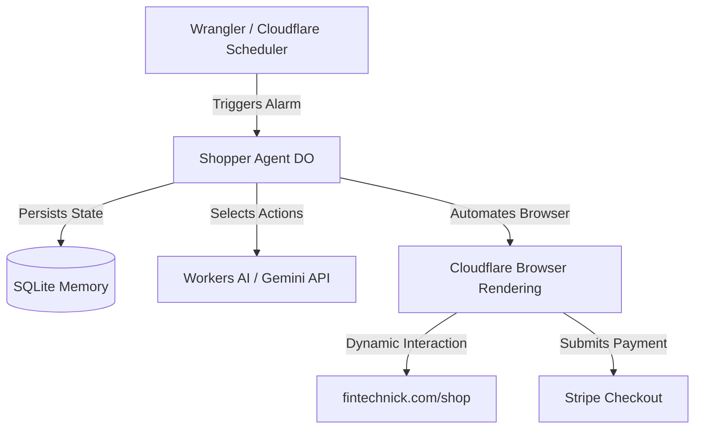

# Cloudflare Agents Project Guide

This document provides an overview of the autonomous e-commerce agent system, its architecture, and instructions on how to set it up and run it on Cloudflare's serverless global network.

## 1. System Overview

The project simulates human shopping behavior on target shops (e.g. `fintechnick.com/shop`). It uses stateful, LLM-driven agents running directly on Cloudflare Workers and Durable Objects to navigate the site, evaluate products, and complete purchases (including automated test checkout forms).

### Architecture Diagram



### Core Components

1.  **Orchestration & State (Cloudflare Agents SDK):**
    *   **Location:** `src/` (TypeScript-first)
    *   **Role:** Manages the execution lifecycle. The agent extends the `Agent` class which leverages Durable Objects to maintain state, memory of past purchases, and schedule future runs programmatically using SQLite.
    *   **Interface:** Exposed via HTTP/WebSocket endpoints using `@callable()` RPC methods.

2.  **Agent Brain (Workers AI / External LLM):**
    *   **Role:** The decision-making engine. It takes a "Persona" (e.g., "A cautious buyer"), analyzes the cleaned interactive DOM elements of the current page, and generates a structured action (click, type, or finish).

3.  **The Hands (Cloudflare Browser Rendering):**
    *   **Role:** Interacts with pages dynamically via Puppeteer.
    *   **Generic Automation:** Instead of hardcoding selectors, it queries the DOM for clickable and input elements, formats them as a simplified schema, and executes the actions decided by the LLM.

---

## 2. Getting Started

### Prerequisites

*   **VS Code Dev Container (Recommended):** The workspace has pre-installed Node.js, npm, Doppler CLI, and all base settings. Simply open this workspace inside the Dev Container.
*   **Cloudflare Account:** A Cloudflare account with a Workers Paid plan or Browser Rendering enabled.
*   **Doppler Account:** Used to securely store and inject development keys.

### Setup Instructions

1.  **Configure Doppler Credentials:**
    Run the login script to authenticate with Doppler and setup the dev config:
    ```bash
    ./scripts/cloud_login.sh
    ```
    Ensure the following secrets are configured in your Doppler config (`dev`):
    *   `GOOGLE_API_KEY`: Your Gemini API key (enables faster/smarter LLM decisions). If not set, the agent automatically falls back to Cloudflare's Workers AI.
    *   `SHOP_URL` (Optional): Overrides the default target store. Defaults to `https://fintechnick.com/shop`.

2.  **Generate Configuration:**
    The system reads configurations from `wrangler.template.jsonc` and injects secrets into local `wrangler.jsonc` (which is excluded from Git to prevent secret exposure). The cloud login script runs this automatically, but you can trigger it manually:
    ```bash
    doppler run -- ./scripts/setup-wrangler-config.sh dev
    ```

---

## 3. Running and Validating the System

### Step 1: Run the Dev Server
Launch the local Wrangler emulation server:
```bash
npm run dev
```
This runs a local emulator of the Worker, Durable Object sqlite database, and maps the bindings.

### Step 2: Trigger a Test Run
With the dev server running in one terminal, open a new terminal tab and trigger the shopper agent test client script:
```bash
node scripts/test-agent.js
```
This script connects to the local DO agent via WebSockets, streams state transitions, and instructs the agent to browse and complete the transaction.

### Step 3: Deploy to Production
Once validated, deploy the worker globally to Cloudflare's edge network:
```bash
npm run deploy
```

---

## 4. Development Workflow

*   **Adding Personas:** Adjust the agent initialization state or call the RPC endpoint with a custom persona parameter.
*   **Improving Site Interactivity:** If the agent struggles to locate fields on specific checkouts, refine the generic Puppeteer DOM parser in `src/browser.ts`.
