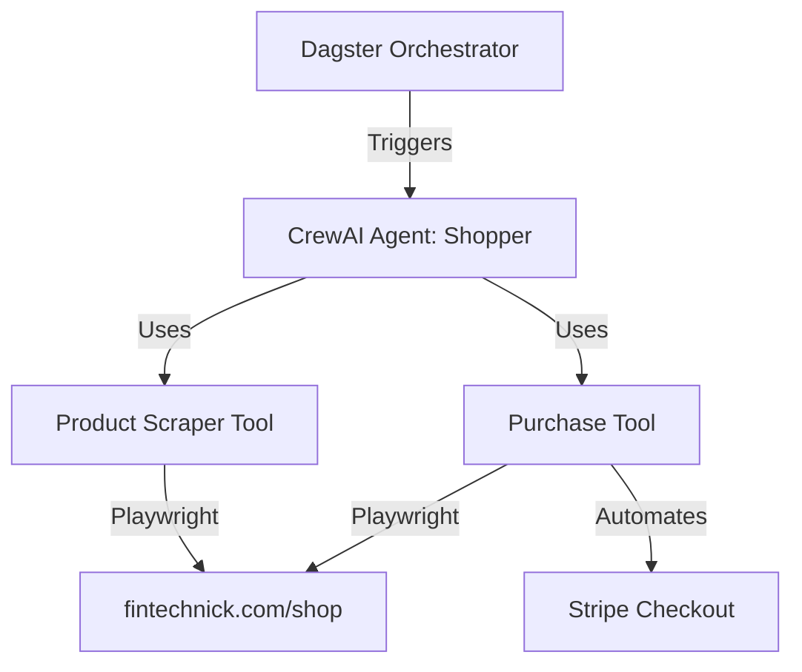

# Shop Agents Project Guide

This document provides an overview of the autonomous e-commerce agent system, its architecture, and instructions on how to set it up and run it.

## 1. System Overview

The project is designed to simulate human shopping behavior on `fintechnick.com`. It uses LLM-driven agents to navigate the site, select products, and complete purchases using Stripe's test mode.

### Architecture Diagram



### Core Components

1.  **Orchestrator (Dagster):**
    *   **Location:** `shop-agents/shop_agents/defs/`
    *   **Role:** Manages the execution lifecycle. It defines "Software-Defined Assets" (like `shopping_result`) and Jobs that can be scheduled or triggered manually.
    *   **UI:** Provides a web interface to track runs, view logs, and manage configurations.

2.  **Agent Brain (CrewAI):**
    *   **Location:** `shop-agents/shop_agents/agents/`
    *   **Role:** The decision-making engine. It takes a "Persona" (e.g., "A cautious buyer") and translates it into tasks.
    *   **Implementation:** Uses the `shopper.py` module to create an agent with specific goals and backstories.

3.  **The "Hands" (Playwright Tools):**
    *   **Location:** `shop-agents/shop_agents/tools/`
    *   **Role:** Interacts with the browser.
    *   **Tools:**
        *   `product_scraper`: Navigates the shop and extracts product info.
        *   `purchase_tool`: Handles the "Buy" button clicks and automates the Stripe Checkout iframe.

4.  **Configuration & LLM:**
    *   **Location:** `shop-agents/shop_agents/config.py` and `llm.py`
    *   **Role:** Manages environment variables (via Pydantic Settings) and initializes the LiteLLM connection (defaulting to Gemini).

---

## 2. Getting Started

### Prerequisites

*   **Python 3.12+**
*   **uv:** For dependency management.
*   **Doppler CLI:** For secret management (recommended).
*   **Playwright Browsers:** Must be installed in the environment.

### Setup Instructions

1.  **Environment Variables:**
    The system expects the following variables (managed via Doppler or a `.env` file in `shop-agents/`):
    *   `GOOGLE_API_KEY`: Your Gemini API key.
    *   `SHOP_URL`: Defaults to `https://fintechnick.com/shop`.

    If using Doppler:
    ```bash
    ./scripts/cloud_login.sh
    ```

    *Note: Dependencies and Playwright browsers are automatically installed during the Dev Container initialization.*

### Running the System

#### Option A: Running with Dagster (Recommended)
This provides a UI to monitor the agent's progress.

```bash
cd shop-agents
uv run dg dev
```
*   Open [http://localhost:3000](http://localhost:3000) in your browser.
*   Navigate to **Jobs** -> **shop_agent_job**.
*   Click **Launchpad** and then **Launch Run**.

#### Option B: Running the standalone main (Minimal)
Currently, `main.py` is a placeholder. To run a session directly from code for debugging, you would typically call `run_shopping_session` from `shop_agents.agents.shopper`.

---

## 3. Development Workflow

*   **Adding Personas:** Modify `shop_agents/defs/__init__.py` to add new configurations or schedules for different shopping behaviors.
*   **Updating Tools:** If the website UI changes, update the selectors in `shop_agents/tools/browser.py`.
*   **LLM Switching:** Change `LLM_PROVIDER` in your environment to switch between `gemini` and other supported models via LiteLLM.
