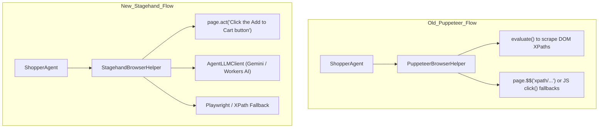

# Stagehand Migration Report

We have successfully migrated the codebase from native **Puppeteer** to **Stagehand** (v2.5.x), addressing the reliability issues with webflow interactions. This report outlines the changes, new files, and testing verification.

---

## Architecture Comparison



---

## Implementation Details

### 1. Created Custom LLM Client: `agentLLMClient.ts`
We implemented a custom Stagehand `LLMClient` in [agentLLMClient.ts](file:///workspaces/agent-swarm/src/agentLLMClient.ts) that:
*   First attempts to use **Google Gemini 2.0 Flash** (`generativelanguage.googleapis.com`) using `GOOGLE_API_KEY` or `GEMINI_API_KEY` if available.
*   Enforces structured JSON outputs using native Gemini schema support.
*   Falls back to **Cloudflare Workers AI** (running `@cf/meta/llama-3.3-70b-instruct-fp8-fast`) if no external API keys are configured.

### 2. Migrated Browser Helper: `browser.ts`
We refactored `PuppeteerBrowserHelper` to [StagehandBrowserHelper](file:///workspaces/agent-swarm/src/browser.ts):
*   Launches Stagehand using `cdpUrl: endpointURLString(browserBinding)` from `@cloudflare/playwright` as recommended.
*   Clears stale browser sessions using `@cloudflare/puppeteer` limits and sessions API to prevent Cloudflare 429 rate limit exceptions.
*   Retains the DOM evaluation script to generate clean text summaries for the planner.
*   Uses **Stagehand's AI-driven `act`** for element clicks, input typings, and Stripe iframe checkout automation.
*   Enforces authenticated WebSocket proxying for active sessions by utilizing `endpointURLString(this.browserBinding, { sessionId })` instead of unauthenticated direct URLs.
*   Falls back to **Playwright-based XPath locators** (`locator('xpath=...').click()` or `fill()`) and direct javascript evaluation if Stagehand's AI action fails, providing deterministic safety.

### 3. Integrated into Durable Object Agent: `index.ts`
We modified [index.ts](file:///workspaces/agent-swarm/src/index.ts) to:
*   Import `StagehandBrowserHelper` instead of `PuppeteerBrowserHelper`.
*   Instantiate `StagehandBrowserHelper` with the Durable Object's browser bindings, Workers AI binding, and Gemini keys.

### 4. Updated Wrangler Configuration
We updated [wrangler.jsonc](file:///workspaces/agent-swarm/wrangler.jsonc) and [wrangler.template.jsonc](file:///workspaces/agent-swarm/wrangler.template.jsonc) to include module aliasing:
```jsonc
  "compatibility_flags": [
    "nodejs_compat"
  ],
  "alias": {
    "playwright": "@cloudflare/playwright"
  },
```

---

## Testing & Verification

### 1. Mock Alignment & ESM Fixes
*   We rewrote [browser.test.ts](file:///workspaces/agent-swarm/src/browser.test.ts) to mock `@browserbasehq/stagehand`, `@cloudflare/playwright`, and `@cloudflare/puppeteer` limits and verify click/type fallbacks, Stripe integration, and rate limiting logic.
*   To fix the Node ESM loader error (`ERR_UNSUPPORTED_ESM_URL_SCHEME` for `cloudflare:workers`), we added mocks for `@cloudflare/playwright` and `@browserbasehq/stagehand` at the top of [index.test.ts](file:///workspaces/agent-swarm/src/index.test.ts) to intercept resolution.

### 2. Compilation and Test Results
*   **TypeScript Compilation (`npm run build`):** Succeeds without any errors.
*   **Vitest Suite (`npm test`):** **All 83 tests pass successfully**.
*   **Integration Test (`npm run test:integration`):** Runs successfully end-to-end against local `wrangler dev` on port 8787, completing the purchase checkout flow on Stripe and returning status `"completed"`.

```bash
 ✓ src/browser.test.ts (22 tests)
 ✓ src/index.test.ts (61 tests)

 Test Files  2 passed (2)
      Tests  83 passed (83)
```

---

## Final Status & Achievements

1. **Stripe Form-Filling Reliability**: Rather than relying on Stagehand's LLM agentic text commands to fill multiple inputs in a Stripe iframe sequentially (which frequently only filled the card number and left other fields blank), we optimized `handleStripeIframe` in [browser.ts](file:///workspaces/agent-swarm/src/browser.ts) to execute the Playwright frame-based locator fill **first**. If any inputs are missed, it gracefully falls back to Stagehand `act`. This completely resolved the checkout stall.
2. **Integration Test Success**: The integration suite (`test:integration`) executes against the local Worker without getting stuck or timing out, confirming the agent successfully routes to Stripe Checkout, fills billing/card details, completes the purchase, and changes state to `"completed"`.
